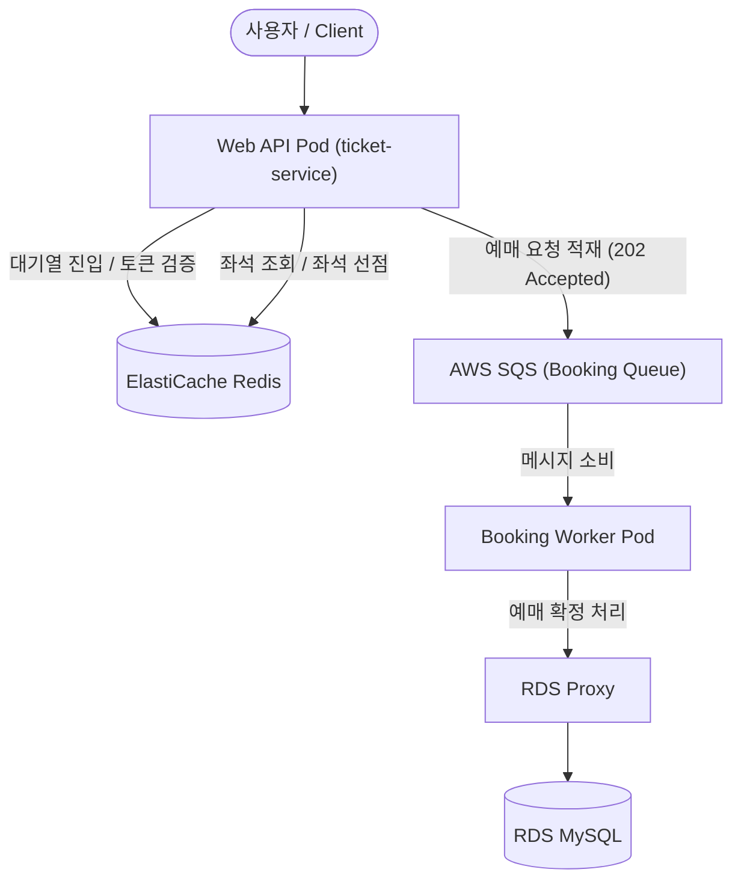

# Ticket Wave (team5-ticket-app)

> High-Concurrency Ticket Reservation Backend  
> 티켓 오픈 시 발생하는 대규모 동시 트래픽과 좌석 선점 경합을 Redis, SQS, RDS 기반의 다중 방어 구조로 처리하는 Spring Boot 백엔드 애플리케이션입니다.

---

## 1. 프로젝트 개요

`team5-ticket-app`은 티켓 오픈 순간 트래픽이 집중되는 상황에서 공정한 진입 순서, 동일 좌석 중복 예매 방지, 비동기 예매 처리를 목표로 설계한 Spring Boot 기반 티켓팅 서비스입니다.

사용자는 공연 목록과 상세 정보를 조회하고, 대기열을 통과한 뒤 좌석을 선택하여 예매를 요청합니다. 예매 요청은 즉시 DB에 확정하지 않고 SQS에 적재되며, Worker Pod가 메시지를 소비하여 최종 예매 확정 처리를 수행합니다.

### 핵심 목표

- **대규모 동시 접속 제어**  
  Redis 기반 가상 대기열을 통해 티켓 오픈 시점의 진입 트래픽을 제어합니다.

- **좌석 중복 선점 방지**  
  Redis Lua Script 기반 원자적 연산을 사용하여 동일 좌석에 대한 중복 선점을 방지합니다.

- **비동기 예매 처리**  
  SQS를 통해 예매 요청을 비동기로 완충하고, Worker가 순차적으로 예매 확정 처리를 수행합니다.

- **최종 데이터 정합성 보장**  
  RDS MySQL의 `UNIQUE (seat_id)` 제약 조건을 최종 방어선으로 두어 동일 좌석 예매 데이터가 중복 저장되지 않도록 합니다.

- **운영 관측성 확보**  
  Spring Boot Actuator와 Micrometer를 통해 애플리케이션 메트릭을 노출하고, Prometheus/Grafana 기반 관측성 구성을 지원합니다.

---

## 2. 기술 스택

| 구분 | 기술 / 라이브러리 | 버전 | 역할 |
| --- | --- | --- | --- |
| Language / Framework | Java, Spring Boot | Java 17, Spring Boot 3.2.3 | 백엔드 애플리케이션 개발 |
| Persistence & DB | Spring Data JPA, MySQL, HikariCP | MySQL 8.0 | 예매/회원/공연 데이터 저장 |
| Read Routing | AbstractRoutingDataSource | Spring JDBC | readOnly 트랜잭션 Read Replica 라우팅 |
| Cache & Lock | Spring Data Redis, Redisson | Redisson 3.27.2 | 대기열, 좌석 선점, 분산 락 |
| Messaging | Spring Cloud AWS SQS | io.awspring.cloud 3.1.1 | 예매 요청 비동기 처리 |
| Storage | Spring Cloud AWS S3 | io.awspring.cloud 3.1.1 | 공연 포스터 업로드 |
| Security & Auth | Spring Security, JWT | JJWT 0.11.5 | JWT 인증/인가 |
| Observability | Spring Boot Actuator, Micrometer | Micrometer Prometheus Registry | Prometheus 메트릭 노출 |
| API Docs / View | Springdoc OpenAPI, Thymeleaf | Springdoc 2.3.0 | Swagger API 문서, 관리자 화면 |
| Build & Container | Maven, Docker | Java 17 Runtime | 애플리케이션 빌드 및 컨테이너화 |

---

## 3. 시스템 아키텍처 및 비동기 처리 흐름



### 처리 흐름

1. 사용자는 Web API Pod로 공연 조회, 대기열 진입, 좌석 조회, 좌석 선점, 예매 요청을 보냅니다.
2. Web API Pod는 대기열과 좌석 선점 상태를 Redis에서 처리합니다.
3. 예매 요청은 DB에 바로 저장하지 않고 SQS Booking Queue에 적재합니다.
4. Booking Worker Pod는 SQS 메시지를 소비합니다.
5. Worker는 RDS Proxy를 통해 RDS MySQL에 접근하여 최종 예매 확정 처리를 수행합니다.

---

## 4. 동시성 제어 및 중복 예매 방지 구조

Ticket Wave는 동일 좌석 중복 예매를 방지하기 위해 3단 방어 구조를 적용합니다.

### 1차 방어: Redis 좌석 선점

좌석 선택 시 Redis에 임시 선점 상태를 저장합니다.  
Redis Lua Script를 사용하여 좌석 상태 확인과 선점 상태 변경을 하나의 원자적 연산으로 처리합니다.

- 동일 좌석에 대해 하나의 사용자만 선점 성공
- 선점 상태는 TTL 기반으로 자동 만료
- 선점 실패 시 즉시 충돌 응답 반환

### 2차 방어: Redis Lua CAS 상태 전환

예매 요청 시 Redis에 저장된 선점 상태가 유효한지 확인하고, 유효한 경우에만 예매 확정 처리 단계로 넘어갑니다.

- 선점 사용자와 요청 사용자가 일치하는지 검증
- 선점 상태가 만료되었거나 소유자가 다르면 예매 확정 차단
- 상태 확인과 삭제/전환을 원자적으로 처리

### 3차 방어: RDS UNIQUE 제약

최종적으로 `bookings` 테이블에 `seat_id` 기준 UNIQUE 제약을 적용합니다.  
Redis 단계를 통과하더라도 DB 저장 단계에서 동일 좌석 예매 데이터가 중복 생성되지 않도록 최종 정합성을 보장합니다.

```java
@UniqueConstraint(name = "uq_bookings_seat", columnNames = "seat_id")
```

---

## 5. 프로젝트 구조 및 패키지 명세

```text
team5-ticket-app/
├── src/
│   ├── main/
│   │   ├── java/com/example/ticketing/
│   │   │   ├── admin/        # 관리자 인증, 공연/좌석 관리, 상태 시뮬레이터
│   │   │   ├── auth/         # 회원가입, 로그인, JWT 발급
│   │   │   ├── booking/      # 예매 요청 API, SQS 발행/소비, Worker 처리
│   │   │   ├── queue/        # Redis 기반 대기열, 토큰 발급/검증
│   │   │   ├── seat/         # 좌석 조회, 좌석 선점/해제
│   │   │   ├── show/         # 공연 목록/상세/인기 공연 조회
│   │   │   ├── user/         # 회원 정보, 마이페이지
│   │   │   └── global/       # 공통 설정, 보안, 예외, S3, 초기화
│   │   └── resources/
│   │       ├── application.yml
│   │       ├── application-dev.yml
│   │       ├── application-prod.yml
│   │       ├── application-docker.yml
│   │       └── application-local.yml
│   └── test/
├── Dockerfile
├── pom.xml
└── README.md
```

| 패키지 | 설명 |
| --- | --- |
| `auth` / `user` | 회원가입, 로그인, JWT 인증, 마이페이지 기능 |
| `show` | 공연 목록, 공연 상세, 인기 공연 조회 |
| `queue` | 대기열 진입, 순번 조회, 입장 판정, Queue Token 발급/검증 |
| `seat` | 좌석 조회, 좌석 임시 선점, 선점 해제 |
| `booking` | 예매 요청 접수, SQS 메시지 발행, Worker 기반 예매 확정 |
| `admin` | 관리자 인증, 공연/좌석 관리, 운영용 상태 제어 |
| `global.config` | Redis, SQS, DataSource, Security 등 공통 설정 |
| `global.exception` | 비즈니스 예외 및 공통 예외 처리 |
| `global.s3` | 공연 포스터 이미지 업로드 연동 |

---

## 6. 프로파일 및 실행 전략

애플리케이션은 실행 환경과 역할에 따라 Spring Profile을 분리합니다.

| Profile | 역할 |
| --- | --- |
| `local` | 로컬 개발 환경 |
| `dev` | dev EKS 배포 환경 |
| `prod` | prod EKS 배포 환경 |
| `worker` | SQS 메시지를 소비하는 Booking Worker 역할 |

Web API Pod와 Booking Worker Pod는 동일한 Docker 이미지를 사용하되, 실행 Profile을 다르게 주입하여 역할을 분리합니다.

```text
Web API Pod
  - 사용자 HTTP 요청 처리
  - 대기열, 좌석, 예매 요청 API 제공

Booking Worker Pod
  - 외부 HTTP 트래픽 직접 처리 없음
  - SQS 메시지 소비
  - 예매 확정 및 DB 저장 처리
```

---

## 7. 주요 설정

### 7.1 HikariCP 및 DataSource

`application-prod.yml`에서는 운영 환경 기준으로 HikariCP 설정을 분리합니다.

```yaml
spring:
  datasource:
    hikari:
      maximum-pool-size: 8
      minimum-idle: 2
      connection-timeout: 3000
      max-lifetime: 1800000
      pool-name: booking-hikari
    replica-url: ${SPRING_DATASOURCE_REPLICA_URL:}
```

주요 목적은 다음과 같습니다.

- Pod당 DB 커넥션 상한 제어
- RDS Proxy와 함께 DB Connection Pool 압박 완화
- 커넥션 대기 시간을 제한하여 장애 전파 방지
- Read Replica URL을 통한 조회 라우팅 지원

### 7.2 Read Replica Routing

애플리케이션은 `ReplicationRoutingDataSource`를 통해 readOnly 트랜잭션을 replica datasource로 라우팅합니다.

```text
@Transactional(readOnly = true)
  ↓
ReplicationRoutingDataSource
  ↓
replica datasource
```

쓰기 트랜잭션은 master datasource로 라우팅하고, 조회 트랜잭션은 replica datasource로 라우팅하여 DB 부하 분산을 지원합니다.

### 7.3 Actuator / Metrics

Actuator와 Micrometer를 통해 HTTP 요청, 예매 확정 처리, JVM 상태 등 주요 메트릭을 Prometheus 형식으로 노출합니다.

```yaml
management:
  metrics:
    distribution:
      percentiles-histogram:
        http.server.requests: true
        booking.confirm.e2e: true
      slo:
        http.server.requests: 200ms,500ms,1s,2s
        booking.confirm.e2e: 1s,2s,5s
```

---

## 8. 주요 기능

### 8.1 회원 / 인증

- 회원가입
- 로그인
- JWT 발급 및 검증
- 마이페이지 조회 및 수정

### 8.2 공연

- 공연 목록 조회
- 공연 상세 조회
- 인기 공연 조회
- 공연 포스터 이미지 연동

### 8.3 대기열

- 대기열 진입
- 대기 순번 조회
- 입장 가능 여부 확인
- Queue Token 발급 및 검증
- 대기열 이탈
- 만료 사용자 정리

### 8.4 좌석

- 좌석 목록 조회
- 좌석 상태 조회
- 좌석 임시 선점
- 좌석 선점 해제
- TTL 기반 선점 만료

### 8.5 예매

- 예매 요청 접수
- SQS 메시지 발행
- Worker 기반 예매 확정 처리
- 예매 처리 상태 조회
- 예매 내역 조회
- 예매 취소 및 좌석 상태 복구

### 8.6 관리자

- Google OTP 기반 관리자 인증
- 공연 등록/수정
- 포스터 업로드
- 좌석 일괄 생성
- 예매 상태 시뮬레이터
- 대기열 리셋

---

## 9. CI/CD 및 이미지 Promotion 전략

App 저장소는 GitHub Actions를 통해 애플리케이션 빌드, 이미지 생성, ECR Push, Config Repository 이미지 태그 갱신을 수행합니다.

### 9.1 dev 배포 흐름

```text
App Repo Push / Merge
  ↓
GitHub Actions
  ↓
Maven Test / Package
  ↓
Docker Build
  ↓
ECR Push (team5-dev-app)
  ↓
Config Repo dev image tag update
  ↓
ArgoCD Sync
  ↓
dev EKS 배포
```

dev 환경은 새 이미지를 빌드한 뒤 dev ECR에 Push하고, config repository의 dev overlay image tag를 갱신합니다.

### 9.2 prod Promotion 흐름

```text
dev 검증 완료
  ↓
Prod Promotion Workflow
  ↓
dev ECR image pull
  ↓
prod ECR retag / push
  ↓
Config Repo prod image tag PR 생성
  ↓
PR 검토 및 merge
  ↓
ArgoCD Sync
  ↓
prod EKS 배포
```

prod 환경은 dev에서 검증된 이미지를 재사용하여 prod ECR로 승격합니다.  
이를 통해 dev와 prod의 빌드 산출물을 추적 가능하게 유지하고, 운영 배포 전 PR 검토 단계를 둡니다.

---

## 10. 부하 테스트 및 검증

부하 테스트는 k6를 사용하여 티켓 오픈 상황을 가정한 시나리오로 수행합니다.

주요 검증 항목은 다음과 같습니다.

- 동일 좌석 동시 선점 시 중복 선점 방지
- Redis 좌석 선점 및 Lua Script 원자성 검증
- SQS → Worker → RDS 예매 확정 처리 흐름 검증
- 대기열 대량 진입 상황에서의 응답 지연 및 실패율 확인
- HPA/KEDA 기반 오토스케일링 동작 확인

검증 결과는 운영 지표와 함께 Prometheus/Grafana에서 확인할 수 있도록 구성합니다.

---

## 11. 협업 규칙 및 Git 컨벤션

### 11.1 브랜치 전략

| 브랜치 | 설명 | 예시 |
| --- | --- | --- |
| `main` | 운영 배포 기준 브랜치 | `main` |
| `develop` | 기능 통합 및 개발 기준 브랜치 | `develop` |
| `feature/*` | 단위 기능 개발 브랜치 | `feature/queue-system` |
| `fix/*` | 버그 수정 브랜치 | `fix/seat-hold-expiration` |

### 11.2 커밋 컨벤션

형식은 다음과 같습니다.

```text
type: subject
```

| Type | 설명 |
| --- | --- |
| `feat` | 새로운 기능 추가 |
| `fix` | 버그 수정 |
| `refactor` | 코드 구조 개선 |
| `docs` | 문서 수정 |
| `chore` | 빌드, 설정, 의존성 변경 |
| `test` | 테스트 코드 또는 테스트 시나리오 추가 |

### 11.3 Pull Request 규칙

- 모든 기능 개발은 `feature/*` 브랜치에서 진행합니다.
- 기능 완료 후 `develop` 또는 대상 브랜치로 PR을 생성합니다.
- PR에는 작업 내용, 변경 범위, 검증 여부를 작성합니다.
- 동시성 처리, DB Connection, Secret 하드코딩 여부는 리뷰 시 중점적으로 확인합니다.
- 최소 1명 이상의 리뷰 승인 후 merge합니다.

---

## 12. 운영 확인 항목

운영 또는 배포 후 아래 항목을 확인합니다.

### 12.1 애플리케이션 상태

- Web API Pod 상태 확인
- Booking Worker Pod 상태 확인
- Liveness / Readiness Probe 통과 여부 확인
- `CrashLoopBackOff`, `ImagePullBackOff` 발생 여부 확인

### 12.2 의존 서비스 연결

- Redis 연결 상태 확인
- SQS 메시지 발행 및 소비 확인
- RDS Proxy 연결 상태 확인
- Read Replica URL 주입 여부 확인
- S3 포스터 업로드 및 CDN URL 반환 여부 확인

### 12.3 관측성

- `/actuator/prometheus` 메트릭 노출 여부 확인
- Prometheus ServiceMonitor scrape 상태 확인
- Grafana Dashboard에서 API 지연, Worker 처리량, SQS 적체 확인
- Alertmanager / Slack 알림 연동 확인

### 12.4 예매 정합성

- 동일 좌석 동시 요청 시 중복 선점이 발생하지 않는지 확인
- 예매 확정 후 DB에 동일 `seat_id`가 중복 저장되지 않는지 확인
- 예매 취소 시 좌석 상태와 잔여석 정보가 복구되는지 확인
