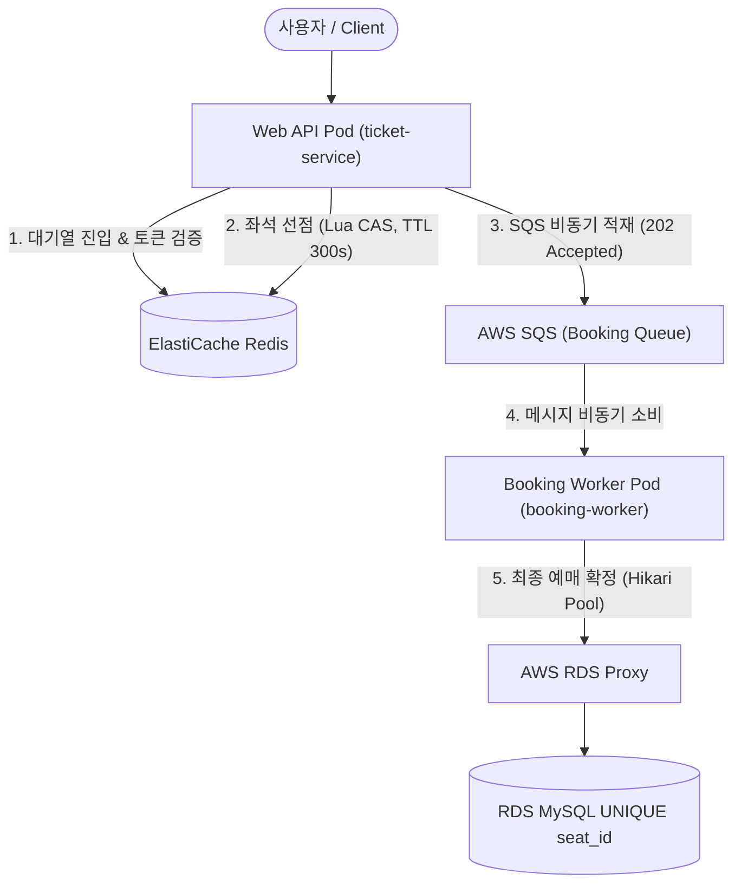

# 🎫 Ticket Wave (team5-ticket-app)

> **S-Tier High-Concurrency Ticket Reservation Platform**  
> 티켓 오픈 시 발생하는 대규모 동시 트래픽과 동시성 경합을 비동기 메시징 및 다중 방어선 아키텍처로 안전하게 처리하는 백엔드 애플리케이션 서비스입니다.

---

## 📋 1. 프로젝트 개요

`team5-ticket-app`은 티켓 오픈 순간 폭주하는 트래픽 환경에서 **공정한 진입 순서 보장**, **동일 좌석 중복 선택 차단**, **비동기 예매 처리를 통한 DB 커넥션 보호**를 핵심 목표로 설계된 Spring Boot 기반 서비스입니다.

### 🌟 핵심 가치 & 문제 해결
- **대규모 동시 접속 통제**: Redis ZSET 기반 가상 대기열을 통해 진입 트래픽을 제어하고 과부하 차단.
- **좌석 중복 선점 방지**: Redis Lua Script 기반 원자적(Atomic) CAS 연산으로 1차 선점(TTL 300초) 관리.
- **DB 커넥션 고갈 차단**: SQS(Standard / FIFO) 비동기 버퍼와 `202 Accepted` & Polling 구조를 도입하여 HTTP API 응답 속도 극대화.
- **최후의 데이터 정합성**: RDS MySQL의 `UNIQUE (seat_id)` 제약 조건으로 물리적 중복 예매 생성 완전 차단.

---

## 🛠️ 2. 기술 스택 (Tech Stack)

| 구분 | 기술 / 라이브러리 | 버전 | 비고 |
|---|---|---|---|
| **Language / Framework** | Java, Spring Boot | **Java 17**, **Spring Boot 3.2.3** | LTS 기반 백엔드 아키텍처 |
| **Persistence & DB** | Spring Data JPA, MySQL | MySQL 8.0, HikariCP | RDS Proxy 연동 및 ORM 엔티티 관리 |
| **Cache & Lock** | Spring Data Redis, Redisson | **Redisson 3.27.2** | 대기열 ZSET 및 원자적 Lua 스크립트 실행 |
| **Messaging** | Spring Cloud AWS SQS | **io.awspring.cloud 3.1.1** | 비동기 예매 큐잉 (Standard / FIFO) |
| **Storage & CDN** | Spring Cloud AWS S3 | **io.awspring.cloud 3.1.1** | 공연 포스터 업로드 및 CloudFront 연동 |
| **Security & Auth** | Spring Security, JWT | JJWT 0.11.5 | JWT 인증/인가 및 Password Hash |
| **Observability** | Spring Boot Actuator, Micrometer | Micrometer Prometheus Registry | ServiceMonitor 연동, SLO/Percentiles 히스토그램 |
| **Template & API Doc** | Thymeleaf, Springdoc OpenAPI | Springdoc 2.3.0 | 관리자 UI 및 Swagger API 명세서 |
| **Build & Container** | Apache Maven, Docker | Multi-stage Build (`eclipse-temurin:17`) | JRE 경량 실행 이미지 |

---

## 🏗️ 3. 시스템 아키텍처 & 비동기 처리 흐름



### 동시성 제어 3단계 이중 방어 구조
1. **1차 방어 (Redis SET NX / Lua CAS)**: 좌석 클릭 시 Redis Lua 스크립트로 300초간 원자적 임시 선점 (Hold).
2. **2차 방어 (SQS Queue & Worker 분리)**: 요청 접수(API Pod)와 DB 쓰기(Worker Pod)를 물리적으로 격리하여 Connection Pool 지연 완충.
3. **3차 방어 (RDS UNIQUE Constraint)**: `bookings` 테이블의 `seat_id` 유니크 제약 조건을 두어 물리적 중복 예매 생성 차단 (실패 시 의도된 `409 Conflict` 반환).

---

## 📂 4. 프로젝트 구조 및 패키지 명세

```text
team5-ticket-app
├── src
│   ├── main
│   │   ├── java/com/example/ticketing
│   │   │   ├── admin         # 관리자 Google OTP 2FA, 공연/좌석 제어, 상태 시뮬레이터
│   │   │   ├── auth          # 회원가입(BCrypt 암호화), 로그인(JWT 토큰 발급)
│   │   │   ├── booking       # 비동기 예매 요청 API 및 SQS Worker Consumer
│   │   │   ├── queue         # Redis ZSET 기반 대기열 진입/순번/토큰 검증 및 자동 승급
│   │   │   ├── seat          # 좌석 조회(multiGet) 및 Redis Lua CAS 임시 선점 (TTL 300s)
│   │   │   ├── show          # 공연 목록/상세 조회 (Read Replica) 및 인기 순위(Sorted Set)
│   │   │   ├── user          # 회원 정보 및 마이페이지 예매 내역 조회
│   │   │   └── global        # Config(Redis, SQS, Security), Exception, Filter
│   │   └── resources
│   │       ├── application.yml
│   │       ├── application-dev.yml
│   │       ├── application-prod.yml
│   │       ├── application-docker.yml
│   │       └── application-local.yml
│   └── test
├── Dockerfile                # Multi-stage Alpine JRE 이미지 빌드
├── pom.xml
└── README.md
```

| 패키지 | 설명 |
|---|---|
| **auth / user** | 회원가입, 로그인, JWT 발급 및 마이페이지 회원 관리 |
| **show** | 공연 조회 성능 향상을 위한 Read Replica 라우팅 및 캐시 구현 |
| **queue** | 대기열 진입, 입장 허가, 만료 토큰 정리 및 대기열 우회 설정 관리 |
| **seat** | 좌석 조회 성능 향상을 위한 `multiGet` 및 동시성 차단용 Lua CAS 선점 |
| **booking** | 비동기 예매 요청 접수(`202 Accepted`) 및 SQS Worker 비동기 컨슘 구현 |
| **global.config** | Redis 커넥션 풀, SQS Listener, Security 필터체인 바인딩 설정 |
| **global.exception** | 비즈니스 예외와 인프라 장애 코드를 명확히 매핑하여 4xx/5xx 핸들링 |

---

## ⚙️ 5. 주요 프로파일 & HikariCP 튜닝 (`application-prod.yml`)

```yaml
spring:
  datasource:
    hikari:
      maximum-pool-size: 8            # Pod당 커넥션 상한 (스케일아웃 시 RDS Proxy 보호)
      minimum-idle: 2                 # 최소 유휴 커넥션
      connection-timeout: 3000        # 3초 커넥션 타임아웃 (적체 조기 차단)
      max-lifetime: 1800000           # 30분
      pool-name: booking-hikari
    replica-url: ${SPRING_DATASOURCE_REPLICA_URL:}

  jpa:
    hibernate:
      ddl-auto: validate              # 운영 스키마 자동 변경 방지
    open-in-view: false

management:
  metrics:
    distribution:
      percentiles-histogram:
        http.server.requests: true    # p99 Latency 수집
        booking.confirm.e2e: true     # Worker E2E 메트릭
      slo:
        http.server.requests: 200ms,500ms,1s,2s
        booking.confirm.e2e: 1s,2s,5s
```

---

## 🚀 6. CI/CD & 이미지 Promotion 전략

App 저장소는 GitHub Actions 파이프라인을 통해 ECR 이미지 빌드 및 Promotion을 수행합니다.

```text
[App Repo Push / Merge]
       │
       ▼
[GitHub Actions (OIDC Auth)] ──> Maven Build & Docker Build
       │
       ▼
[ECR Push: team5-dev-app (tag: dev-{SHORT_SHA})]
       │
       ▼ (dev 환경 검증 완료 후 Promotion)
[ECR Retag & Push: team5-prod-app (tag: prod-{SHORT_SHA})]
       │
       ▼
[Config Repo Image Tag PR 생성 ──► ArgoCD Sync]
```

---

## 📊 7. 부하 테스트 검증 성과 (k6 Benchmark)

- **[시나리오 1] 동시성 폭풍 (360석 동일 클릭)**: 360석 중복 예매 0건, 정합성 100% 입증 (**p99 360ms**).
- **[시나리오 2] 대기열 우회 한계 측정 (1,200 VU)**: 톰캣 스레드 고갈 파괴 테스트를 통해 가상 대기열 도입의 당위성 입증.
- **[시나리오 3] 5만 대기열 대량 인입 흡수 (50,000 VU)**: JJWT Parser 싱글톤 재사용 및 Redisson 커넥션 풀 튜닝을 통해 **50,000 VU 대기열 인입 시 HTTP 실패율 0.00% 및 p95 9.73초 흡수 성공**.

---

## 🤝 8. 협업 규칙 & Git 컨벤션

### 8.1 브랜치 전략 (Git Flow)
| 브랜치 | 설명 | 예시 |
|---|---|---|
| **`main`** | 운영 환경 배포 브랜치 | `main` |
| **`develop`** | 기능 통합 및 개발 환경 배포 브랜치 | `develop` |
| **`feature/*`** | 단위 기능 개발 전용 브랜치 | `feature/queue-system`, `feature/booking-worker` |
| **`fix/*`** | 버그 수정 브랜치 | `fix/seat-hold-expiration` |

### 8.2 커밋 컨벤션
형식: `type: subject`
- `feat`: 새로운 기능 추가
- `fix`: 버그 수정
- `refactor`: 코드 구조 개선 및 튜닝
- `docs`: README, API 명세 등 문서 작업
- `chore`: 빌드/의존성/프로파일 설정 변경

### 8.3 Pull Request 및 코드 리뷰 규칙
- 모든 기능 개발은 `feature/*`에서 진행하며, 완료 시 `develop`을 대상으로 PR을 제출합니다.
- PR 제출 시 **작업 내용, 변경 범위, 테스트 검증 여부**를 필수로 명시해야 합니다.
- 동시성 문제 유발 가능성, DB Connection 유출 여부, Secret 정보 하드코딩 여부 등을 동료가 상호 리뷰한 뒤 1명 이상의 승인을 득한 후 Merge합니다.
